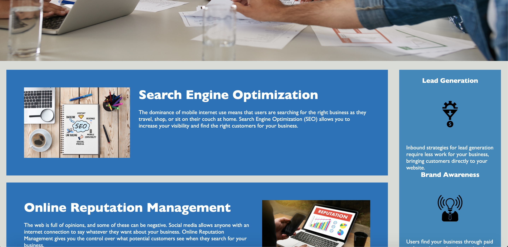
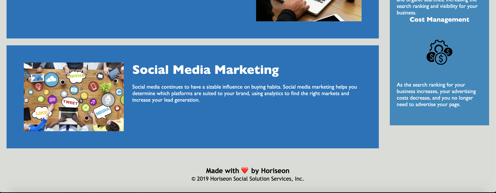

# Project Description
The goal of this project is to refactor code so that it meets acessibility standards and is optimized. This was done by adding section tags instead of div's and getting rid of repetitive code in the stylesheets for the html. Various class links had the exact same code in the CSS so they could be removed by using one class link for all of them. Broken links were also fixed.  

# What the Website Looks Like
This is three separate images but the actual website is seamless. Visit the link to the deployed application to see what it actually looks like. 

# Link to Deployed Application
Link: https://anishasnet.github.io/horiseon/
